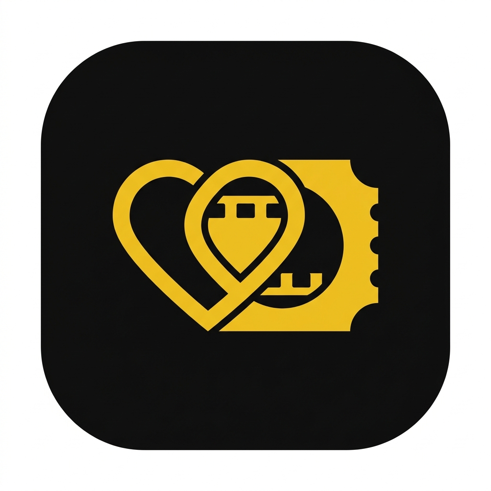

# 🍿 CinePair — Találd meg a pároddal a tökéletes filmet!

<div align="center">
  
  <p><i>CinePair 2.0 — Prémium moziélmény pároknak, egyenesen a zsebedben.</i></p>
</div>

---

A **CinePair** egy modern, reszponzív PWA (Progressive Web App) alkalmazás, amivel véget vethetsz a "mit nézzünk ma?" vitáknak. Húzzátok el a filmeket, és ha mindkettőtöknek tetszik valami, bumm: **MATCH!**

## ✨ Főbb funkciók

- **Swipe & Match:** Tinder-szerű filmválasztó interakció.
- **Valósidejű szinkronizáció:** Azonnali visszajelzés, ha a párod is kedvel egy filmet.
- **Push Értesítések:** Találat esetén azonnali értesítés a telefonodra.
- **PWA támogatás:** Telepíthető alkalmazásként, natív érzéssel (nincs böngészőkeret).
- **Részletes filminfók:** Trailer nézés (YouTube), műfajok, IMDb értékelések és leírások.
- **Okos szűrők:** Megjelenési év és műfaj szerinti keresés (TMDB adatok alapján).
- **Hungarizált felület:** Teljesen magyar nyelvű, letisztult UI.

## 🚀 Technológiai stack

- **Frontend:** React + Vite + TailwindCSS
- **Adatbázis & Auth:** Firebase (Firestore & Google Auth)
- **Animációk:** Framer Motion (3D kártyaeffektel)
- **API:** TMDB (The Movie Database) API
- **Ikonok:** Lucide React

## 🛠️ Helyi fejlesztés

**Előfeltételek:** Node.js (v18+)

1.  **Telepítés:**
    ```bash
    npm install
    ```
2.  **Környezeti változók:**
    Hozd létre a `.env` fájlt az alábbi kulccsal:
    ```env
    VITE_TMDB_API_KEY=a_te_tmdb_api_kulcsod
    ```
3.  **Futtatás:**
    ```bash
    npm run dev
    ```

## 📱 Használat

1. Lépj be a Google fiókoddal.
2. Másold ki az azonosítódat a **Profil** menüben.
3. Küldd el a párodnak, ő pedig írja be a saját profiljánál a "Partner összekötés" mezőbe.
4. Kezdjetek el swipe-olni a főoldalon!

---

*© 2026 CinePair — Made with ❤️ for couples.*
